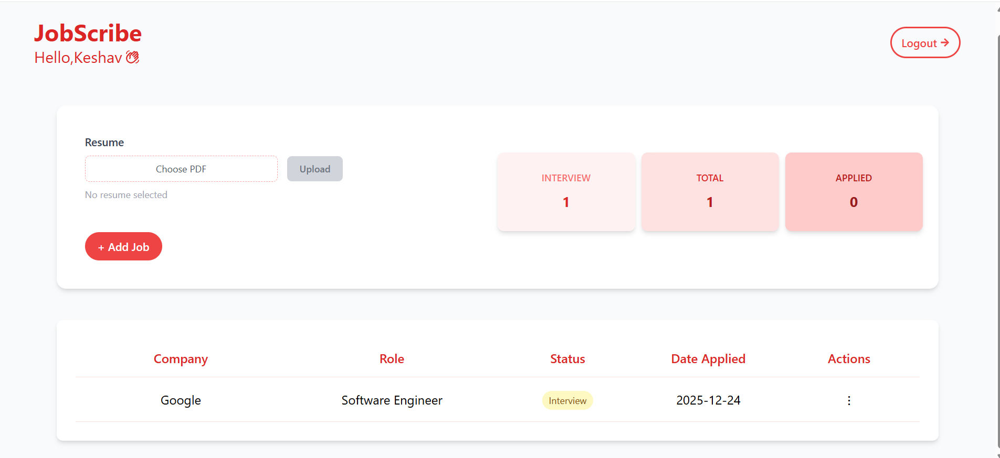

<h1 align="center">🚀 JobScribe</h1>

<p align="center">
A MERN application for tracking jobs and optimizing resumes with AI suggestions for individual job roles.<br>
Fully responsive for Mobile and Desktop
</p

<h2>🌟 Features Included</h2>
<ul>
  <li>JWT authentication, cookies for storing tokens</li>
  <li>Redis for blacklisting tokens</li>
  <li>Error Handling</li>
  <li>Input Validations</li>
  <li>AI-based suggestions using Gemini</li>
   <li>pdf-parse for extracting text from pdf</li>
</ul>

<h2>👤 User Actions</h2>
<ul>
  <li>Register and Log in</li>
  <li>Create, Update, Delete jobs</li>
  <li>Upload PDF resumes</li>
  <li>Get AI suggestions from Gemini Model</li>
  <li>Track jobs on dashboard</li>
  <li>See status of interviews, total jobs, and applied jobs</li>
</ul>

<h2>🛠 Technologies Used</h2>
<ul>
  <li>Frontend: React, Tailwind CSS</li>
  <li>Backend: Node.js, Express, Gemini API, Redis</li>
  <li>Database: MongoDB</li>
</ul>

<div align="left">
  
  
  
  
  
  
  
  
  
  
  
</div>

<h2>📂 Folder Structure</h2>
<pre>

```id="9k2m1x"
JobScribe/
│── backend/
│   │── node_modules/
│   │── src/
│   │   ├── controller/
│   │   │   ├── auth.controller.js
│   │   │   ├── job.controller.js
│   │   │   └── resume.controller.js
│   │   │
│   │   ├── db/
│   │   │   ├── db.js
│   │   │   └── redis.js
│   │   │
│   │   ├── middlewares/
│   │   │   ├── auth.middleware.js
│   │   │   └── validator.middleware.js
│   │   │
│   │   ├── models/
│   │   │   ├── user.model.js
│   │   │   ├── form.model.js
│   │   │   └── resume.model.js
│   │   │
│   │   ├── routes/
│   │   │   ├── auth.routes.js
│   │   │   ├── job.routes.js
│   │   │   └── resume.routes.js
│   │   │
│   │   ├── services/
│   │   │   └── ai.service.js
│   │   │
│   │   └── tests/
│   │
│   │── app.js
│   │── server.js
│   │── .env
│   │── package.json
│   │── package-lock.json
│   │── .gitignore
│
│── frontend/
│   │── node_modules/
│   │── public/
│   │── screenshots/
│   │── src/
│   │   ├── api/
│   │   ├── assets/
│   │   ├── components/
│   │   ├── context/
│   │   ├── pages/
│   │   ├── routes/
│   │   ├── App.jsx
│   │   ├── main.jsx
│   │   └── index.css
│   │
│   │── index.html
│   │── package.json
│   │── package-lock.json
│   │── vite.config.js
│   │── tailwind.config.js
│   │── postcss.config.js
│   │── eslint.config.js
│   │── .env
│   │── .gitignore
│   │── README.md
```

</pre>

<h2>⚙️ Environment Variables</h2>
<pre>
MONGOdb_URL=your_mongodb_connection_string
REDIS_HOST=your_redis_host
REDIS_PASSWORD=your_redis_password
REDIS_PORT=your_redis_port
JWT_SECRET_KEY=your_jwt_secret
GEMINI_API_KEY=your_gemini_api_key
</pre>

<h2>🖼 Dashboard Screenshots</h2>



<h2>🌐 Live Demo</h2>
<p><a href="https://job-scribe-y68v.onrender.com">Check Deployed App</a></p>
